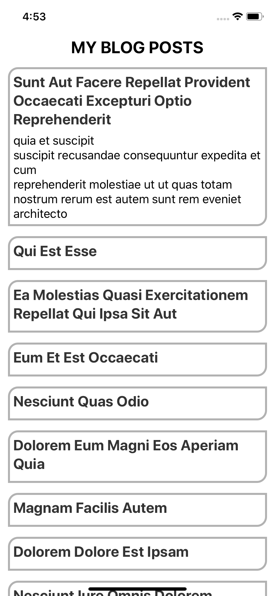

# React Native Detox E2E With Mocha Starter

This is a React Native init starter app set up with Detox and Mocha for end-to-end testing.

It has a single single screen that displays a list of posts fetched from `https://jsonplaceholder.typicode.com/posts`. I use the `FlatList` component to display each post's title and body text.

The body text is hidden by default and when one clicks on the post title it reveals the body text. I used Detox and Mocha to test that both the title at the top is visible and the toggle functinality are working as expected.

Note that the repo is the result of me playing around with Detox this week for work.

## How To Use

Assuming that you have Detox globally installed on your machine:

- Clone this repo
- Run `yarn` to install the dependencies
- Run `cd ios` and `pod install`
- Run `detox build` to build the app for e2e testing
- Run `detox test` to start the tests

Open `e2e/App.spec.js` to add more tests
